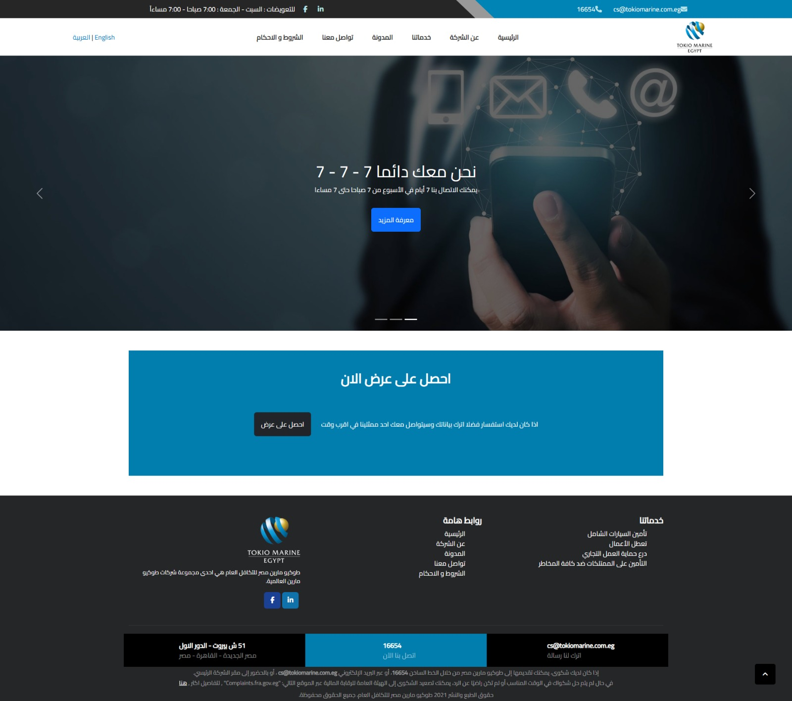

 
 
 
 
 
 
 
 

# Tokio Marine Group Egypt - Official Website

*Note: This repository serves as a portfolio showcase and architectural overview. The source code is proprietary and private.*

## Overview
This project is the official web portal for **Tokio Marine Group Egypt**, providing comprehensive information about insurance services, corporate news, and customer support. The application is built to serve both Arabic and English-speaking users natively.

**Live Website:** [Insert link to the live website here, e.g., https://www.tokiomarine.com.eg]

## Tech Stack & Architecture
* **Framework:** ASP.NET Core MVC (C#)
* **Design Pattern:** Model-View-Controller (MVC)
* **Frontend:** HTML5, CSS3, JavaScript (Razor Pages)
* **Localization:** Implemented utilizing ASP.NET Core `RequestLocalizationOptions` to seamlessly switch between Arabic (RTL) and English (LTR) cultures based on user preference and routing.

## Key Features Developed
Based on the application architecture, the following modules were implemented:
* **Bilingual Support (AR/EN):** Full dynamic localization for all views, routing, and data models.
* **Service Modules:** Dedicated sections for various insurance lines (Motor, Property, Marine, Medical, Engineering, Casualty, Credit).
* **Quotation System (`GetQuoteController`):** Interactive forms allowing users to request and calculate insurance quotes.
* **Blog & Media (`BlogController`):** Dynamic blog post management and news updates.
* **Customer Interaction (`ContactUsController`):** Secure contact forms, claim notifications, and branch locators.
* **Data Persistence & Email:** Integrated services for handling emails (`IEmailService`) and securely storing backup data.

## Localization Details
To achieve a high-quality bilingual experience without duplicating views, the project leverages ASP.NET Core's built-in localization features. 
* Configured `RequestLocalizationOptions` to support `ar-EG` and `en-US`.
* Resource files (`.resx`) manage static content translations.
* Dynamic CSS rendering is applied depending on the active culture (RTL for Arabic, LTR for English).

## Screenshots

